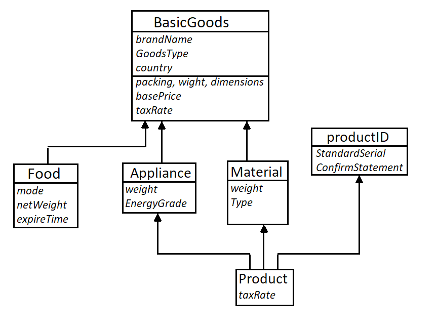
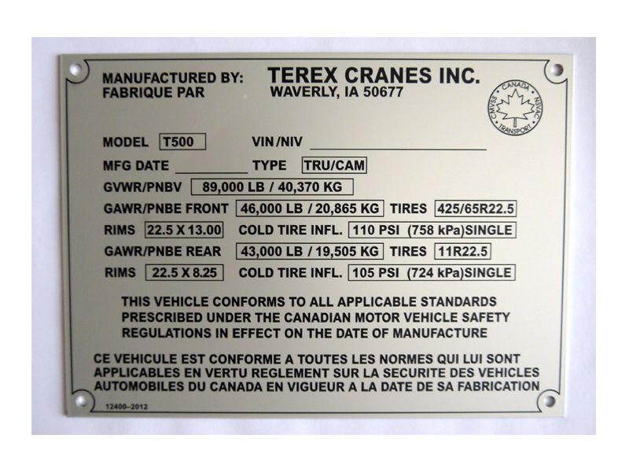
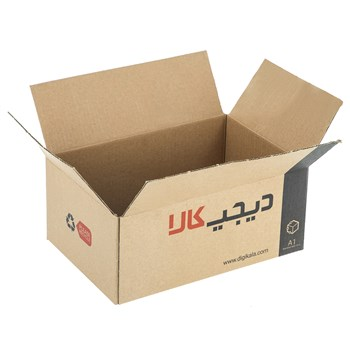
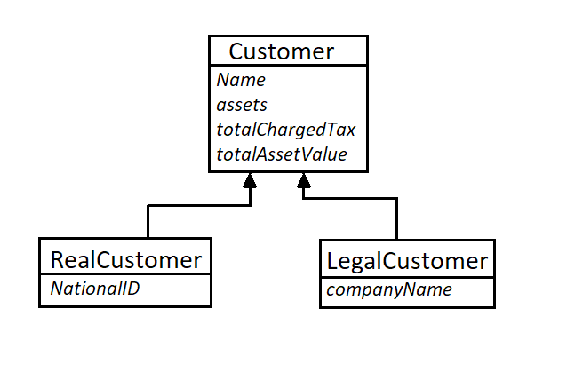
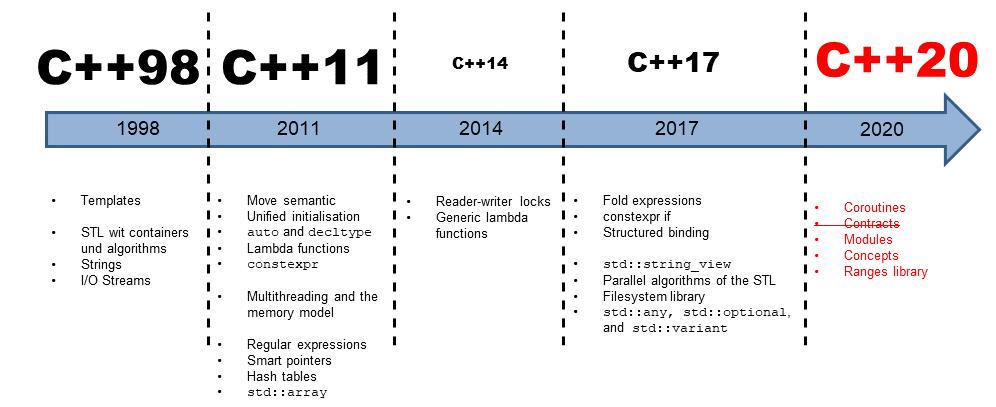

# Storehouse Management

The Customs has been managing their entrepot using outdated methods. Having faced with some problems, the heads of Customs eventually decided to use computers to keep track of their stuff.


In this homework you are going to ease the management of a massive goods depot. The basic idea is to create hierarchy **Goods** objects, manipulate features of them and in the next step, make **Customers** as much as needed. These Customers own the goods which they have imported.


## Goods are supposed to be designed Good!

Before we start, lets take a look at the hierarchy:


As you can see, We need you to create these classes:
* BasicGoods
* Food
* Material
* Appliance
* *productID*
* Product


**Note that productID does not have any parents**.

The protoype of these classes has been given to you, and the __necessary__ memeber variables and some of the methods are also *provided*.

**Uncomment** the functions given in the header files. You **may modify** these functions if needed, but **dont remove** them. 

You may need to add other functions, inheritance directives and etc. 


There is a description of each class in the what follows:

## BasicGoods


Before we introduce BasciGoods class memebers, we need to define two enumerative types:

*`PACK_TYPE`* which has following names:  UNKNOWN, RAW, CAN, NYLON, CARTON, BARREL

*`GOODS_TYPE`* which has following names: CONSUMABLE, DISPOSABLE, OBJECT 

`hint:` you should use enum class like this:
```C++
enum class (name of type)
{ (modes) };
```

You have to implement this cosntructor:
```C++
BasicGoods(const std::string& bName, GOODS_TYPE gTyp, double price);
```
**Note** : When constructing a `BasicGoods`, you have to set the _taxRate_ to `INITIAL_TAX_RATE` (given in the file) , and _packing_ to `UNKNOWN`. 

Also, set the _weight_ to `0.1` (as a default). This weight is supposed to represent the weight of packing, not the Goods itself.


* **Question1:**
For some reasons, we dont want users to be able to make a copy of this class (this is temporary, though). The question is, How do you ban users from copying *BasicGoods* objects? how do you define these: 
```C++
BasicGoods(BasicGoods&);
BasicGoodsBasicGoods&&);
```

* **Question2:** 
```C++ 
virtual ~BasicGoods(); ```

You know that we want to inherit this class into *Food*, *Appliance* and *Material* and also, we are going to define this class's destructor as virtual. Can you describe a situation where `making this _virtual_` is avoiding some problems?


* ```C++
virtual double getEndPrice(void) const;
```
This function should apply the adjusted tax rate (`taxRate`) to the `basePrice` and return the fixed price (which ordinary people would pay for it).

$$
\begin{align}
End Price = basePrice * (1+\frac {taxRate} {100})
\end{align}
$$

* ```C++
virtual double getTaxPrice(void) const;
```

This funciton calculates how much people are payin as tax, it is defined as:

$$
TaxPrice = basePrice * \frac {taxRate} {100}
$$

* getters and setters

```C++
// getters
std::string getBrandName(void) ;
virtual double getWeight(void) const;
virtual double getVolume(void) const;
```
What these getters and setters do is obvious from their names. The volume is the product of elemnts of approxDim:
$$
volume = approxDim[0] * approxDim[1] * approxDim[2]
$$

```C++
// setters
void setOriginCountry(const std::string& cnt);
void setNewPrice(double price);
void setAppearance(PACK_TYPE pck, std::shared_ptr< std::array<double,3> > dimen);
```

* Here are operators! :
```C++
// operators
virtual bool operator== (const BasicGoods& in) const; 
virtual bool operator< (const BasicGoods& in) const;
```
The policy for two BasicGoods to be __Equal__ is to have same :
`GOODS_TYPE` , `brandName` and `basePrice`

Operator< : when comparing two BasicGoods, you have to compare the fixed price of them i.e. EndPrice (the only exception is Food objects - they will be discussed later in Foods). Note that a BasicGoods can sometimes point to a derrived class thus you have to be careful when comparing...


* Private method:
```C++
void setNewPrice(double price);
```
Reassign the given price to basePrice.

## Food


Of course, traders typically import packaged and long life food products...

Header for this

This class is publicly inheriting the _BasicGoods_. 

For these kind of Goods we have decided to add `FOOD_MODE` which can be useful when we want to classify or get some statistics about what is being imported into the country. To do this, you need to define another enumerative class and create  `LIQUID`, `CREAM` and `SOLID` consts to it. 

Because foods is a crucial goods, there is lower tax on them. thus you nedd to **subtract** the `FOOD_TAX_SUBSIDE` from base `taxRate` when calculating their taxes and EndPrice.

_do not alter `taxRate` of BasicGoods_

Another feature that these goods have is *ExpirationTime* which is stored in a `std::time_t` object.
This struct holds time as number of seconds elapsed from 00:00:00 Jan 1st 1970, known as Unix time (or epoch time).

When construction a Food, set the expirationTime to 2 weeks from the moment that program starts, that is, you need to read time when constructing a Food.


* Here are the main constructors:
```C++
Food(const std::string& name, double price, double netWei, FOOD_MODE md); // default FoodMode is SOLID
```
Assign the `name` as the `brandName` of basicGoods. When no FOOD_MODE is given, consider it as SOLID.

Note that food objects have the GOODS_TYPE as `CONSUMABLE`

You have to consider a default packing and a default dimension when creating Foods depending on `FOOD_MODE`. 
the default dimension for a Food is a function of it's netWeight, given as below:

> LIQUID : choose a CAN packing, default dimensions: 0.3, 0.4, (0.2*netWeight) 

> CREAM  : choose a BARREL packing, default dimensions: 0.3, 0.4, (0.3*netWeight)

> SOLID  : choose a NYLON packing, default dimensions: 0.3, 0.4, (0.7*netWeight)


* Getters:
```C++
// getters
double getEndPrice(void) const;
double getTaxPrice(void) const override;
double getWeight(void) const;
std::time_t getRemainingExp(void) const;
```
To calculate the EndPrice you have to use following rule:
$$
EndPrice = basePrice * (1 + \frac {taxRate - SUBSIE} {100})
$$

Calculating `TaxPrice` goes the same way BasicGood goes, but remember to _subtract_ the `SUBSIDE`

To return the weight, you have to add the `netFood` weight and the packing weight (which is the BasicGoods weight)

To return the **remaining** expiration date, first you have get the current time, using `std::time`, the subtract the `expireTime` from current time. 


* Setters:
```C++
// setters
void setExpiration(std::time_t t);
void setFoodMode(FOOD_MODE md);
```
These two functions are clear by their names, they set new features. Dont allow an `ExpirationTime` earlier than now!!! (get current time and compare)


* *Operators:*
You have to write `operator<` and `operator==` such that they work both on Food and on a basePointer (or reference) (which is BasicGoods).

Note that the policy for two Foods being equal is that both must satisfy the conditions of BasicGoods and also have same `FOOD_MODE`. 
Also, Food is not equal to BasicGoods or Material or Appliance or Product. (which is reasonable!)

Note: your operators should determine between a real BasicGoods and a BasicGoods which is actually other goods (Appliance, Material etc.)

The policy for comparing two `Food`s is by comparing their expiration date. Say for example, Food A will be expired two todays from now and the Food B will be expired one days from now on, then `B<A` is **true**.


In case you are comparing a `Food` with another `Goods`, you should compare their fixed price (EndPrice). 

## Appliance (or tools)

Appliance is usually used for TVs, Refrigerators, Washing machines or Dishwashers, but here, we relaxed the term a little bit and and use it wider.


Appliance also inherits `BasicGoods` as public.

Each appliance consumes energy at some level, so again you need to define a enumerative class for keeping the grade of energy an appliance consumes. 
These levels are : `IRRELEVANT`, `LOW`, `MEDIUM`, `HIGH` . name this enum `ENERGY_COST`

* main constructor:
```C++
Appliance(const std::string& name, double price, double Wei);
```
`Wei` is the weight of the appliance only and it is different from BasicGoods weight.

All appliance have `OBJECT` GoodsType. 

_Do not alter `taxRate` of BasicGoods in any class_.

**Question3:** We want appliance goods objects to be able to setNewPrice for BasicGoods inside them. How do you do this without overriding that function from BasicGoods? in other words, how do you change access of setNewPrice for Appliance goods?

* NOTE: You should also write `operator==` for this class. The policy for two Appliance to be same is that first they must satisfy BasicGoods equality conditions, second they have to have same Energy Grade and same Weight(not including weight of their basicGoods)

* NOTE:
This function must be placed in protected scope:

```C++
double getEndPrice(void) const;
```
**Question4** We are placing the getEndPrice function of this class into private scope, thus user cannot access it directly. Tell us how user can do a trick to access this?


* Getters and setters 
```c++
public:
double getWeight(void) const ;
double getTaxPrice(void) const;
void setWeight(double w);
void setEnergyGrade(ENERGY_COST ec);
```
The getWeight function must return the total weight, that is sum of BascGoods weight and Appliance weight.

setWeight only sets the Appliance weight.


* EndPrice policy: When an Appliance has High EnergyCost, you should use `APPLIANCE_EXTRA_TAX_HIGH` plus the base taxRate, otherwise you have to use `APPLIANCE_EXTRA_TAX_MEDIUM` .

$$
EndPrice = basePrice * (1+\frac {taxRate+(APPLIANCE . EXTRA . TAX . ?)} {100})
$$


**Question5** How do you give access to users for `approxDim` of the BasicGoods in this class as public? 
(Also give this access in your code, too)

## Material


Raw materials can be of 3 main kinds: `NORMAL`, `FLAMABLE`, `HAZARDOUS` , then you need agian to define an enumerative class which stroes these types and use it when constructing a Material object. Name it `MAT_TYPE`.

* main constructor:
```C++
Material(const std::string& name, double price , double weight, MAT_TYPE mt);
```

The arguments cleary shows what they are going to do. However, pay attention that the weight is for the Material class, not the BasicGoods. You should assign name to the `brandName` of the base (BasicGoods).
Set the default `MAT_TYPE` to `NORMAL` so that users be able to create Materials without giving `NORMAL`.

Materials have a `CONSUMABLE` GoodsType.

Again to calculate the EndPrice, add the extra tax rate of material (which is 1.5%) to the taxRate, when calculating it:
$$
EndPrice = basePrice * (1 + \frac {taxRate + ExtraTax} {100})
$$

_Do not alter `taxRate` of BasicGoods in any class_.

* Getters:
```C++
double getWeight(void) const;
double getTaxPrice(void) const;
double getEndPrice(void) const;
```

When returning the weight, you should add both given weight of the matrial and also packing weight (weight of innate BasicGoods).
TaxPrice is calculated the same way for Food.

* The policy for two Material to be the same is to have equality of BasicGoods (`GOODS_TYPE`, `brandName` and `basePrice`) annd also have same material weights.


## productID

Purpose of this class is to hold an identity for Products.



This identity consists of a _Serial number_, _confirmationStatemnet_ and the _countryName_.
_countryName_ will be later assigned the same name of a BasicGoods innate of a product. 

**Question6** what is an abstract class?

Member variables:
```C++
std::string standardSerial;
std::shared_ptr< std::string > confirmStatement;
std::string countryName;
```

* Primary constructor:
```C++
productID(std::shared_ptr< std::string >& in , const std::string& ss);
```

`in` is the Confirmation Statement and `ss` is standard serial.

One may only provides confirmation statement, and no serial number, then give a default value to that (empty string).


* printer functions:
```C++
void printStatement(void) const;
```
This function prints the Confirmation Statement inside square brackets ([]) and the origin country, like this:

`Legal Confirmation Statement: [<confirmationStatemnet>] , producer country: <countryName>`

For example, if the confirmation statement is "This is a registerd Co." and the countryName is "Korea", then you would print that like this:

`Legal Confirmation Statement: [This is a registerd Co.] , producer country: Koread`

Also, your code should support `operator<<` such that this gives the output:
```c++
std::cout << *(pointer to productID);
```
in this format:

`Legal Confirmation Statement: [<confirmStatement>] 
producer country: <countryName> , serial number: <standardSerial>`


**Question7** We dont want users to instantiate this class. How do you do this **without** making the productID an abstract class? (don't remember that Products needs to inherit from this class)

## Product

Products are advanced appliances, they may contain some material, too. And they also have identities.



Finally, we have all our base classes. Lets create a product class.


Member variable:
```C++
double taxRate;
```

* This class inherits _publicly_ from *Appliance*, *Material* and *productID*

Primary constructor of this class is :
```C++
Product(const std::string& bName, double price, double matWei, std::shared_ptr<std::string> confState);
```

You should pass the arguments correctly to the base classes. _matWei_ is the weight of any material that product might have. 

> Products will be `OBJECTS` when setting their GOODS_TYPE. 

> Defult weight of Appliance inside a product is 0.3.


* You may encounter some ambiguity during constructing this class. Remember we need only one BasicGoods object for this class.


Assume that Products will have a typical tax rate of 23 (Also given in the header file).


> All Products have `CARTON` packing.

> As a policy, you should set the intial approxDim of a Product. Thus, you need to create one and assign it to the approxDim of BasicGoods. 

Use these intial dimensions: `0.5, 0.8, 1.2 * (1 + matWei)`. For example, if the material weight of a given Product is 10, then approxDim shoule be : 0.5, 0.8, 13.2

* There are some getter function which you need to refactor them.
```C++
double getWeight(void) const;
void setTaxRate(double newTax);
```


getWeight returns sum of BasicGoods's weight, appliance weight and material's weight.


setTaxRate sets the taxRate Product's taxRate, not the one for BasicGoods.

If you want to calculate EndPrice, use Product's taxRate and also EXTRA TAX OF APPLIANCE based on the policy of appliance (EnergyCost determines ):

$$
EndPrice = basePrice * (1 + \frac {ProductTaxRate + ApplianceExtraTax} {100})
$$


The TaxPrice for the a Product is calculated as following:

$$
EndPrice = basePrice * ( \frac {ProductTaxRate + ApplianceExtraTax} {100})
$$

For example consider a product:

> price = 500

> ENERGY_COST = HIGH

> calling setTaxRate(33);

$$
EndPrice = 500 * (1 + \frac {23 + 17} {100}) = 750
$$

#### Congratulations!
you have completed all types of required goods holders. now its time to focus on people and their money!

## Customer

This is an abstract class. Each customer has a deque which holds all assets of a customer.
The customer also has a corresponding name


Each Customer has the following Member variables:

```C++
std::string name;
double totalChargedTax;
double assetValue;
std::deque< std::shared_ptr<BasicGoods> > assets;
```

_totalChargedTax_ will hold the sum of taxes which that customer is paying, it is usually :
$$
    totalChargedTax = \sum (basePrice * \frac {Proper.tax.rate} {100})
$$

For each goods, tax rate is different.

_assetValue_ is the sum of all EndPrices of ones goods.

* Here is the primary constructor of a Customer:
```C++
explicit Customer( cosnt std::string& name);
```

* In this class, we have defined this:
```C++
using sharedBG = std::shared_ptr<BasicGoods>;
```


* This class must have the following member function:

```C++
double getTotalChargedTax(void) const;
double getTotalAsset(void) const;
std::string printBasicInfo(void) const;
```

Getter functions return the variables.

printBasicInfo prints the name, No. of goods (assets), assetValue and totalChargedTax in a pretty way in a string.

Format:
`<Name of Customer> >> No of assets: <No>, Total Asset: <totalAsset>, Charged Tax: <chargedTax>`

exmaple:
`Kevin >> No of assets: 23, Total Asset: 892, Charged Tax: 4`

* __Importing Goods__

```C++
virtual void importNewGoods(std::shared_ptr<BasicGoods>);
```

`importNewGoods` should get a smart pointer to a goods and tie it with that customer's assets. You may want to update assetValue and etc.


* __Import using iterators__

Overload the importNewGoods function such that it accepts a `begin` and an `end` iterator, and copy the values in that range. For example, this code must work:

```c++
std::vector<sharedBG> A{...};
Customer* x = addres of a Real or Legal Customer;
x->importNewGoods(A.begin(), A.end());
```

After overloading, `importNewGoods` must be able to accept standard STL container iterators, such `std::vector<>::iter...` , `sd::deque<>::iter...` and ...

* __findGoods using a function pointer as a filter__

We want to select some goods of a customer that satisfy a role (a function pointer) and fill them into the input std::deque, take for instance, all goods that have a fixed price over 50 :
```C++
auto checkPrice = [] (std::shared<BasicGoods>& in) { return (in->getEndPrice() > 50); };
```

We need you to write a method for `Customer` class that takes a `deque` as input and copies all elements of Customer's own `assets` into that input where those elements satisfy an `Comp` object:

```C++
template <class T> void Customer::findGoods( std::deque< sharedBG >& in, T comp);
```

**You are not allowed to use `for` or `while` or `do...while` inside this function.** You can use STL functions.

**Question8** :
What is the drawback of using `erase_remove` idiom for the `findGoods` ?


* __Priority_Queue filler__
```C++
template <class T>
bool queueGoods<T>( std::priority_queue< sharedBG, std::deque<sharedBG> , Shared_less<BasicGoods> >& Q);
```
This function fills the input `Q` with all the assets that are of type `T`.
The T can be _Food_, _Appliance_, _Material_ and _Product_. 
As you can guess, using this function we want to collect for example all _Food_  that one have (also, in an ordered fsahion).


**Note on Shared_less** : We know that a priority queue is ordered. For this order, we need appropirate comparison. You need to create a template Functor called `Shared_less`. This functor sholud compare two shared `T` while pointing to them and not thier address.
(You see, when you comapare two shared_ptr their address will be compared)
Write this template function inside __SharedComps.hpp__ . 

Notice that a compare functor :
> * returns a bool

> * gets two const reference to the operands to be compared. 

Our operands in here are `std::shared_ptr<T>` .

 


* Operators:

```C++
virtual bool operator==(const Customer& in) const = 0;
```

The policy for two customers to be same is that they have to have same names, 
> In case of two RealCustomers: their name and nationalID must be the same.

> In case of two LegalCustomers: their name and companyName must be the same.

> In case of one Real and one Legal Customer : there is no equality. 

* You are also required to declare the `operator<`.

The policy behind this operator is rather simple:

First, If the two operands are equal (using operator==) the result is _false_. Second, all RealCustomers are lower than LegalCustomers, finally, comparing two Reals or two Legals, the name of the two Customers are compared (compare two std::string).

**Just** remember, Customer pointers and references must be capable of doing operator< and a Customer pointer can be Real or Legal !.


## RealCustomer

This class publicly inherits from Customer class.

It has a memeber variable : nationalID, which is a string.

Implement operator== and operator< according to the description of Customer

Primary constructor:
```C++
RealCustomer(const std::string& name, long int nid);
```
`nid` is national ID. If no nationalID is given, set it by default to 0;
(Someone may create a RealCustomer without giving `nid`, then you need to modify the constructor).

## LegalCustomer
This class inherits Customer publicly.

It has a member variable : companyName, which is a string.

Implement operator== and operator< according to the description of Customer

Primary constructor:
```C++
LegalCustomer(const std::string& corrName, const std::string& compName);
```


_____________________________________________________________________________________________________

# Storehouse Class !

This class holds customers of a Storehouse. Then enables the Customs head to manage their ports.

Primary constructor of this class is:
```C++
explicit Storehouse( const std::stirng& NAME);
```


we add a Customer to this class by using this function:
```C++
void newCustomer(std::shared_ptr<Customer> newC);
```

This class has following member variables:
```C++
std::string storeName;
std::set< std::shared_ptr<Customer> > theCustomers;
```
Does the second member, std::set of theCustomers, holds customers uniquely? For example, we have the two following RealCustomers:
> RealCustomer: name = "HassanZadeh" , nationalID = 334 , possesses 3 Appliance and 2 Food goods.

> RealCustomer: name = "HassanZadeh" , nationalID = 334 , possesses 5 Food and 10 Product goods.

we know that they are not unique, they are the same customers with different list of goods. 

**Note** change the declaration of member variable `std::set theCustomers` such that it wont accept these two ID-duplicate RealCustomers.

**Bonus** Write `newCustomer` such that if it gets non-unique customer, automatically copies the goods of input to the current customer inside the set.


* Print!
```C++
std::string printCustomers(void) const;
```

This function prints a list of customers in a std::string ; you have to provide these:

> type: Real or Legal?

> Number of assets that customer has

> total asset Value

> total tax he/she has to pay (totalChargedTax)

You can use printBasicInfo of a customer, preceded by a `Real` or `Legal`. exmaple:

`Real: Kevin >> No of assets: 23, Total Asset: 892, Charged Tax: 4`

## There is always more!


# Python
In this homework you're going to do some very easy tasks in python for the beginning...

## Image(File) Coding
In this task, you must define a ```code``` function which gets an image name (filename) and a function. It then reads each byte of the file and passes it to the given function and replaces that byte with the function output. In this way, you're somehow *coding* the file so that the operator system can no longer open and display that image (file). To get the file back you must do the same procedure with the inverse of that function. The function should work like this

```python
code('a.jpg', lambda x: 255 - x)
```

**Question 9**: What happens when you run the above code twice? Explain.

## Factorial and Dynamic Programming
In this task, you would implement the **Factorial** class. It must have a **dict** as its member function so that whenever it found factorial of a new number, it stores it in the **dict** variable. Your class should work like the below codes.

```python
fact = Factorial()
print(fact(5))  #  output: 120
print(fact.dict) # output: {1: 1, 2: 2, 3: 6, 4: 24, 5: 120}
```
